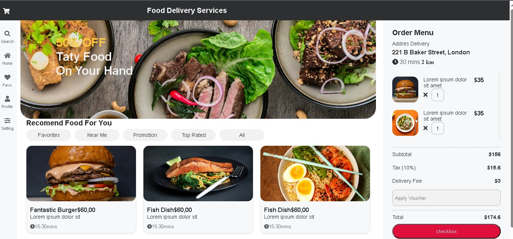

      <h1> Ifood
         
   

# Visão Geral: <h1>
Projeto desenvolvido na faculdade, do curso : Análise e desenvolvimento de Sistemas, orientado pelo professor Anderson.  
Site Ifood.  
 Responsível. 

# Tecnologias Utilizadas: 
 .Visual Studio Code;   
 .Front-end: HTML, CSS e JS.  
 .Bootstrap. 

 